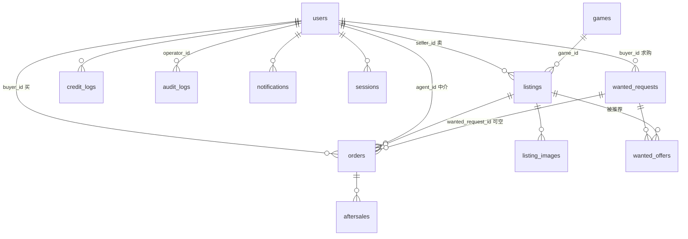

# 方块寄售平台 · 数据模型初稿

> 配合 `01-产品大纲-v2.md` 阅读。数据库 PostgreSQL，ORM 用 Prisma。
> 约定：所有表都有 `id`（bigint 自增主键）、`created_at`、`updated_at`，下面不再重复列。需要软删除的表加 `deleted_at`。时间字段统一 `timestamptz`。

## 表关系总览



## users 用户

| 字段 | 类型 | 说明 |
|---|---|---|
| username | varchar(16) 唯一 | 2 到 16 字符 |
| password_hash | text | argon2id |
| qq | varchar(12) 唯一 | 纯数字 |
| qq_verified_at | timestamptz | 邮箱验证码通过时间 |
| phone | varchar(11) 唯一 | 第一版只校验格式 |
| phone_verified_at | timestamptz 可空 | 预留短信验证 |
| role | enum: user / agent / admin | 一个账号一个角色 |
| credit_score | int 默认 100 | |
| deal_count | int 默认 0 | 成交次数，买卖合计 |
| no_show_count | int 默认 0 | 爽约次数 |
| no_show_locked_until | timestamptz 可空 | 爽约锁定到期 |
| status | enum: active / banned | |
| ban_reason | text 可空 | |
| ban_until | timestamptz 可空 | banned 且为空 = 永久 |
| username_changed_at | timestamptz 可空 | 30 天限一次 |
| avatar_path | text 可空 | |
| notify_email | bool 默认 true | 是否发 QQ 邮箱通知 |
| agent_intro | text 可空 | 中介简介，买家选中介时看 |
| agent_accepting | bool 默认 true | 中介是否接新单 |

索引：username、qq、phone 各一个唯一索引。role 普通索引，用于列中介。

## games 游戏模板

| 字段 | 类型 | 说明 |
|---|---|---|
| code | varchar(32) 唯一 | 例如 `mc` |
| name | text | 显示名 |
| attr_schema | jsonb | 属性字段定义数组，见下 |
| title_template | text | 例如 `{rank} · {level} 级 · {ign}` |
| enabled | bool | |

`attr_schema` 元素结构：

```json
{
  "key": "level",
  "label": "Hypixel 等级",
  "type": "int | enum | multi_enum | text | year | bool",
  "options": ["VIP", "VIP+"],
  "required": true,
  "public_in_list": true
}
```

第一版只插入 MC 一条：level、rank、ign、capes、can_rebind_email、ban_record、ban_note、reg_year。

## listings 商品

| 字段 | 类型 | 说明 |
|---|---|---|
| seller_id | FK users | |
| game_id | FK games | |
| title | text | 系统按模板生成 |
| price | int | 元 |
| fee_mode | enum: all_in / exclusive | 全包 / 不包 |
| source | enum: self_bought / mfa / second_hand | 自购正版 / MFA / 二手 |
| has_transaction_id | bool | 能否提供交易 ID |
| contact | text | 仅中介和超管可见 |
| note | text 可空 | 200 字内 |
| preferred_agent_id | FK users 可空 | 卖家指定中介 |
| attrs | jsonb | 游戏属性，按 attr_schema 校验 |
| status | enum: pending_review / on_sale / rejected / off_shelf / in_trade / sold / deleted | |
| review_note | text 可空 | 拒绝原因 |
| reviewed_by | FK users 可空 | |
| reviewed_at | timestamptz 可空 | |
| dirty_since_approval | bool 默认 false | 下架后是否改过，决定重新上架要不要审核 |
| weight | int 默认 0 | 超管手动权重 |
| pinned_until | timestamptz 可空 | 置顶截止时间。超管按时长设置，`> now()` 即在置顶栏，过期自然落回网格，不需要定时任务 |
| mc_uuid | varchar(32) 可空 | 正版 ID 解析出的 Mojang UUID，用于拉 Hypixel 数据 |
| api_snapshot | jsonb 可空 | 提交时抓到的官方快照 `{uuid, name, level, rank, rankRaw, fetchedAt}`，审核核对与「官方数据一致」标签用 |
| view_count | int 默认 0 | |
| approved_at | timestamptz 可空 | 首次通过时间，排序用 |
| sold_at | timestamptz 可空 | |
| deleted_at | timestamptz 可空 | 软删除 |

索引：
- `(status, weight desc, approved_at asc)` 列表页主查询。信用分在 users 表，排序时 join。
- `(pinned_until) where pinned_until is not null` 部分索引，置顶栏与后台「只看置顶中」用。
- `seller_id`。
- `attrs` 上建 GIN 索引，供等级、会员类型筛选。

列表页查询意图：置顶栏 `where pinned_until > now()`，网格 `where pinned_until is null or pinned_until <= now()`，两边都 `order by weight desc, seller.credit_score desc, approved_at asc`，只有网格分页。

## hypixel_players Hypixel 数据缓存

| 字段 | 类型 | 说明 |
|---|---|---|
| uuid | varchar(32) 主键 | Mojang UUID，无横线小写 |
| name | text | 最近一次抓到的玩家名，`lower(name)` 有索引，24 小时内可当名字缓存 |
| summary | jsonb | 归一化后的玩家摘要（等级、会员、分游戏统计等），不存原始返回体 |
| skyblock | jsonb 可空 | SkyBlock 摘要，没玩过为空 |
| fetched_at | timestamptz | 缓存 6 小时，手动刷新 10 分钟冷却 |

## listing_images 商品截图

| 字段 | 类型 | 说明 |
|---|---|---|
| listing_id | FK listings | |
| path | text | 压缩加水印后的文件路径 |
| sort_order | int | 第一张作缩略图 |
| width / height / bytes | int | |

原图不保留，上传时压缩打水印后只存一份。

## orders 意向单

| 字段 | 类型 | 说明 |
|---|---|---|
| listing_id | FK listings | |
| buyer_id | FK users | |
| seller_id | FK users | 冗余，方便按卖家查 |
| agent_id | FK users 可空 | 待分派时为空 |
| status | enum: pending_assign / pending_contact / in_progress / completed / cancelled | |
| buyer_message | text 可空 | 买家留言 |
| final_price | int 可空 | 成交金额，不含中介费，完成时填 |
| fee_calculated | int 可空 | 系统按阶梯算的中介费 |
| fee_actual | int 可空 | 中介实收，默认等于 fee_calculated |
| fee_override_reason | text 可空 | 两者不同时必填 |
| cancel_reason | enum 可空: buyer_quit / seller_quit / mismatch / price_disagree / sold_elsewhere / other | |
| cancel_note | text 可空 | |
| cancelled_by | FK users 可空 | 系统自动关闭时为空 |
| warranty_until | date 可空 | 完成时按配置天数算 |
| agent_note | text 可空 | 中介备注 |
| wanted_request_id | FK wanted_requests 可空 | 买家从求购单的推荐点「去下单」时挂上；该单完成时求购单随之「已完成」。取消不回滚（2026-09-05 新增） |
| assigned_at / started_at / completed_at / cancelled_at | timestamptz 可空 | |

约束：
- 部分唯一索引 `(listing_id, buyer_id) where status in (pending_assign, pending_contact, in_progress)`。同一买家同一商品只能有一张未关闭单。
- 部分唯一索引 `(listing_id) where status = in_progress`。一个商品同时只能有一张交易中的单。
- 应用层校验 `buyer_id != seller_id`，`agent_id not in (buyer_id, seller_id)`。

索引：`agent_id, status`（中介工作台）、`buyer_id`、`listing_id, created_at`（排队顺序）、`wanted_request_id` 部分索引 `where wanted_request_id is not null`（求购详情反查意向单）。

## wanted_requests 求购单

2026-09-05 新增。买家发布「我想买什么样的账号 + 预算」，发布即公开、不经审核。标题由条件自动生成，买家不写。

| 字段 | 类型 | 说明 |
|---|---|---|
| buyer_id | FK users | 发布者 |
| game_id | FK games | 第一版只有 MC |
| title | text | 系统按条件生成，例如「MVP+/MVP++ · 100 级以上 · 官方披风 · 预算 ¥3,000～¥5,000」，列表与通知里用 |
| ranks | jsonb string[] 默认 `[]` | 可接受的会员类型，空 = 不限 |
| min_level | int 可空 | 最低 Hypixel 等级 |
| capes | jsonb string[] 默认 `[]` | 想要的披风，空 = 不限 |
| budget_min | int 可空 | 元 |
| budget_max | int | 元，必填 |
| requirements | text 可空 | 其他要求，300 字内，公开可见；发布时拦违禁词与联系方式 |
| preferred_agent_id | FK users 可空 | 买家指定中介，中介台把指定自己的排前面 |
| status | enum: open / fulfilled / closed / removed | 求购中 / 已完成 / 已关闭 / 已下架 |
| expires_at | timestamptz | 到期后不再公开、不能被推荐，展示为「已过期」（不落库，查询时比较，不用定时任务）；买家可续期 |
| admin_note | text 可空 | 管理员下架原因，买家可见 |
| removed_by | FK users 可空 | |
| view_count | int 默认 0 | |
| closed_at | timestamptz 可空 | 完成 / 关闭 / 下架时间，恢复时清空 |

约束：`budget_max > 0`；`budget_min is null or budget_min <= budget_max`。

索引：`(status, expires_at, created_at desc)` 大厅与中介台主查询（`status = open and expires_at > now()`）；`buyer_id`（我的求购）。

## wanted_offers 对求购单的账号推荐

2026-09-05 新增。卖家把自己在售 / 交易中的账号、或中介 / 超管把市场上任何在售账号推荐给一张求购单。

| 字段 | 类型 | 说明 |
|---|---|---|
| request_id | FK wanted_requests，级联删除 | |
| listing_id | FK listings | 被推荐的账号 |
| seller_id | FK users | 账号的卖家；推荐人是中介时也记，双方都能看到这条 |
| offered_by | FK users | 推荐人：卖家本人，或中介 / 超管 |
| message | text 可空 | 留言，200 字内，过违禁词与联系方式 |
| status | enum: pending / accepted / declined / withdrawn / closed | 待买家回应 / 买家已下单 / 已谢绝 / 已撤回 / 已关闭 |
| responded_at | timestamptz 可空 | 状态离开 pending 的时间 |

约束：唯一索引 `(request_id, listing_id)`。同一账号对同一求购单只有一条记录：待回应 / 已采纳 / 已谢绝时不能再推，撤回后再推是更新这条。

索引：`listing_id`、`offered_by`（我推荐过的）、`(request_id, status)`（详情页列表与有效推荐计数）。

状态流转：买家点「去下单」并成功下单 → accepted，意向单挂 `orders.wanted_request_id`；买家谢绝 → declined；推荐人或卖家撤回 → withdrawn；求购单完成 / 关闭 / 下架时所有 pending → closed 并通知推荐人。账号是否还能买不落库，前端按 `listings.status` 判断。

## aftersales 售后

| 字段 | 类型 | 说明 |
|---|---|---|
| order_id | FK orders | 只允许 completed 且在质保期内的单 |
| opened_by | FK users | 买家 |
| description | text | 不过违禁词 |
| status | enum: open / resolved / rejected | |
| result | enum 可空: refund / negotiated / rejected | |
| result_note | text 可空 | |
| seller_at_fault | bool 可空 | 判定卖家责任，触发扣分 |
| handled_by | FK users 可空 | 中介 |
| closed_at | timestamptz 可空 | |

## credit_logs 信用分流水

| 字段 | 类型 | 说明 |
|---|---|---|
| user_id | FK users | |
| delta | int | 正加负减 |
| balance_after | int | 变动后余额 |
| reason_type | enum: deal / manual / aftersale / no_show / ban | |
| reason_text | text | 用户可见 |
| ref_type | text 可空 | order / aftersale |
| ref_id | bigint 可空 | |
| operator_id | FK users 可空 | 系统自动时为空 |

用户页面直接读这张表展示变动记录。

## audit_logs 操作日志

| 字段 | 类型 | 说明 |
|---|---|---|
| operator_id | FK users | |
| action | text | view_contact / review / edit_listing / delete_listing / set_weight / pin / assign_order / cancel_order / ban / unban / credit_adjust / set_role / setting_change / wanted_remove / wanted_restore |
| target_type | text | listing / order / user / setting / wanted |
| target_id | bigint 可空 | |
| before | jsonb 可空 | 变更前 |
| after | jsonb 可空 | 变更后 |
| ip | inet | |

索引：`operator_id, created_at`、`target_type, target_id`。只追加不修改。

## notifications 站内通知

| 字段 | 类型 | 说明 |
|---|---|---|
| user_id | FK users | |
| type | text | review_passed / review_rejected / order_new / order_started / order_completed / order_cancelled / order_waiting / aftersale_update / credit_changed / announcement；求购：wanted_new（指定中介）/ wanted_offer（买家收到推荐；中介推别人的账号时卖家也收）/ wanted_offer_accepted / wanted_offer_declined / wanted_closed / wanted_fulfilled / wanted_removed |
| title | text | |
| body | text | |
| link | text 可空 | 点击跳转 |
| read_at | timestamptz 可空 | |
| emailed_at | timestamptz 可空 | 已发 QQ 邮箱 |

索引：`user_id, read_at`。

## verification_codes 验证码

| 字段 | 类型 | 说明 |
|---|---|---|
| target | text | 邮箱地址，将来也可放手机号 |
| code_hash | text | 不明文存 |
| purpose | enum: register / reset_password / change_qq | |
| expires_at | timestamptz | 10 分钟 |
| used_at | timestamptz 可空 | |
| attempts | int 默认 0 | 错 5 次作废 |

同一 target 每分钟最多发 1 条，每天最多 10 条，应用层限流。

## sessions 登录会话

| 字段 | 类型 | 说明 |
|---|---|---|
| user_id | FK users | |
| token_hash | text 唯一 | cookie 里放明文 token |
| expires_at | timestamptz | 30 天滚动 |
| ip | inet | |
| user_agent | text | |

## banned_words 违禁词

| 字段 | 类型 | 说明 |
|---|---|---|
| word | text 唯一 | |
| created_by | FK users | |

初始数据：黑卡、黑号、盗号、代刷、外挂。

## blacklist 注册黑名单

| 字段 | 类型 | 说明 |
|---|---|---|
| type | enum: qq / phone | |
| value | text | |
| reason | text | |
| source_user_id | FK users 可空 | 来源于哪个被封用户 |

唯一索引 `(type, value)`。封禁用户时自动写入两条。

## settings 系统配置

| 字段 | 类型 | 说明 |
|---|---|---|
| key | text 主键 | |
| value | jsonb | |
| updated_by | FK users | |

初始 key 和默认值：

| key | 默认值 | 对应大纲 |
|---|---|---|
| fee_tiers | 见下 | 第 6 节 |
| warranty_days | 7 | 第 8 节，⚠待定 |
| max_active_listings | 10 | 4.1 |
| min_credit_to_list | 60 | 第 7 节 |
| max_open_orders | 3 | 5.2 |
| no_show_limit | 3 | 5.2 |
| no_show_lock_days | 30 | 5.2 |
| credit_penalty_aftersale | 50 | 第 7 节 |
| credit_penalty_no_show | 5 | 第 7 节 |
| show_sold_price | true | 第 9 节 |
| announcement | "" | 10.1 |
| wanted_max_active | 3 | 第 17 节，单个用户同时挂的求购单上限 |
| wanted_default_days | 30 | 第 17 节，发布表单默认有效期与续期天数 |

`fee_tiers` 结构：

```json
[
  { "min": 1,    "max": 200,  "type": "fixed",   "value": 15 },
  { "min": 201,  "max": 500,  "type": "fixed",   "value": 30 },
  { "min": 501,  "max": 2000, "type": "percent", "value": 6 },
  { "min": 2001, "max": null, "type": "percent", "value": 5 }
]
```

percent 结果向上取整到元。

## 关键业务规则落在哪

| 规则 | 实现位置 |
|---|---|
| 一 QQ 一号 | users.qq 唯一索引 + blacklist |
| 同一买家同一商品一张单 | orders 部分唯一索引 |
| 一个商品同时一张交易中单 | orders 部分唯一索引 |
| 完成时自动加分 | 事务内：更新 orders、两条 credit_logs、两个 users.credit_score、listings.status、关闭同商品其他单、写 notifications |
| 封禁自动下架 | 事务内：users.status、listings.status 批量改 off_shelf、blacklist 写两条、audit_logs |
| 查看联系方式留痕 | 接口层每次读 listings.contact 或 users.qq 时写 audit_logs |
| 数字规则可调 | 全部读 settings，不写死 |
| 同一账号对同一求购只一条推荐 | wanted_offers 唯一索引 `(request_id, listing_id)`；撤回后再推是更新 |
| 求购到期自动消失、可续期 | 不落库不用定时任务：大厅 / 中介台 / 推荐都查 `expires_at > now()`，续期只改 expires_at |
| 据求购下单 → 成交后求购完成 | createOrder 事务内：校验求购单是买家自己的且有效、该账号的 pending 推荐改 accepted、orders.wanted_request_id 挂上；completeOrder 事务内：wanted_requests.status = fulfilled、其余 pending 推荐 closed、写 notifications |
